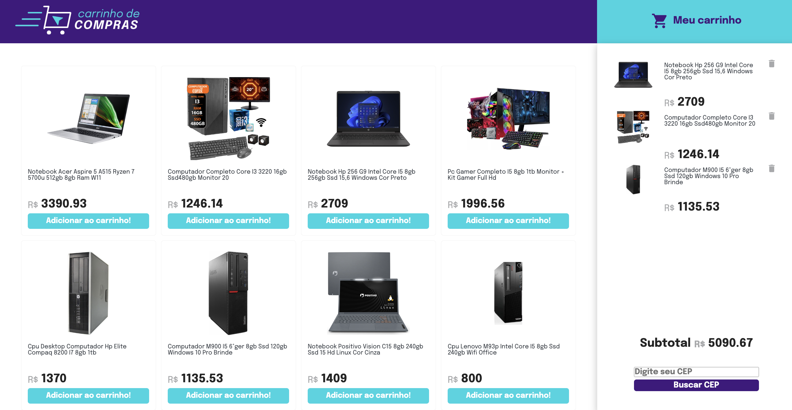

# Example Shopping Cart Site with Mercado Livre API - Not Finished

## Introduction

This project was developed during my time studying at Trybe. It showcases an example website that utilizes the Mercado Livre API to create products and simulate a shopping cart. Users can explore Mercado Livre products and add items to their cart. The interface is designed for desktop use.

## Key Features

- Integration with the Mercado Livre API to display available products.
- Product presentation including titles, prices, and images.
- Easy addition of products to the shopping cart.

## Prerequisites

Before running this project, ensure you have the following dependencies installed:

- [Node.js](https://nodejs.org/) and [npm](https://www.npmjs.com/) for server execution and package management.

## How to Run

1. Clone this repository.
2. Install dependencies: `npm install`.
3. Start the server: `npm start`.
